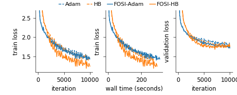

# FOSI

FOSI is a library for improving first order optimizers with second order information.
Given a first-order base optimizer, 
FOSI works by iteratively splitting the function to minimize into pairs of quadratic problems on orthogonal subspaces,
then using Newton's method to optimize one and the base optimizer to optimize the other.

Our analysis of FOSI’s preconditioner and effective Hessian proves that FOSI improves the condition number for a large family of optimizers.
Our empirical evaluation demonstrates that FOSI improves the convergence rate and optimization time of GD, Heavy-Ball, and Adam when applied to several deep neural networks training tasks such as audio classification, transfer learning, and object classification and when applied to convex functions.

For more information, see our paper, [FOSI: Hybrid First and Second Order Optimization](https://arxiv.org/pdf/2302.08484.pdf).

## Installation

FOSI is written in pure Python.
We support installing `fosi` package on Linux (Ubuntu 20.04 or later) and the installation requires Python >=3.8.

### CUDA toolkit

To run FOSI with GPU, CUDA toolkit must be installed.
If using conda environment, the installation command is:
```bash
conda install -c "nvidia/label/cuda-11.8.0" cuda
```
Otherwise, a global installation is required:
```bash
sudo apt-get install cuda
```
After installing CUDA toolkit, follow [NVIDIA's environment setup instructions](https://docs.nvidia.com/cuda/cuda-installation-guide-linux/index.html#environment-setup)
to set the environment variables PATH and LD_LIBRARY_PATH.
To find the lib/bin folders in case of conda environment use `find ~ -name 'libcusolver.so.11'` and in case of a
global installation with apt-get `find /usr/ -name 'libcusolver.so.11'` and use the containing folder.

Note: CUDA toolkit installation is not required when using the Docker container to run the experiments, or if running on the CPU.


### FOSI package

Use the following instructions to install a
binary package with `pip`, or to download FOSI's source code.

To download FOSI's source code run:
```bash
git clone https://github.com/hsivan/fosi
```
Let `fosi_root` be the root folder of the project on your local computer, for example `/home/username/fosi`.

To install FOSI run:
```bash
pip install git+https://github.com/hsivan/fosi.git -f https://storage.googleapis.com/jax-releases/jax_cuda_releases.html
```
Or, download the code and then run:
```bash
pip install <fosi_root> -f https://storage.googleapis.com/jax-releases/jax_cuda_releases.html
```

## Basic usage of FOSI

FOSI can work with both [JAX](https://github.com/google/jax) and [PyTorch](https://github.com/pytorch/pytorch) frameworks.
When using JAX, FOSI uses [Optax](https://github.com/deepmind/optax) optimizers as base optimizers,
and its API is designed to be similar to that of Optax optimizers.
In the case of PyTorch, FOSI utilizes [TorchOpt](https://github.com/metaopt/torchopt) optimizers as base optimizers,
and its API is designed to be similar to that of TorchOpt optimizers.

### JAX
This example demonstrates the application of FOSI with the Adam base optimizer for a program based on JAX.

```python
import os
# Note: To maintain the default precision as 32-bit and not switch to 64-bit, set the following flag prior to any
# imports of JAX. This is necessary as the jax_enable_x64 flag is later set to True inside the Lanczos algorithm.
os.environ['JAX_DEFAULT_DTYPE_BITS'] = '32'

from fosi import fosi_adam
import jax.numpy as jnp
import jax
import optax
import haiku as hk

key = jax.random.PRNGKey(42)
n_dim = 100
target_params = 0.5

# Single linear layer w/o bias equals inner product between the input and the network parameters
model = hk.without_apply_rng(hk.transform(lambda x: hk.Linear(1, with_bias=False, w_init=hk.initializers.Constant(0.0))(x)))

def loss_fn(params, batch):
    x, y = batch
    y_pred = model.apply(params, x).squeeze()
    loss = jnp.mean(optax.l2_loss(y_pred, y))
    return loss

def data_generator(key, target_params, n_dim):
    while True:
        key, subkey = jax.random.split(key)
        batch_xs = jax.random.normal(subkey, (16, n_dim))
        batch_ys = jnp.sum(batch_xs * target_params, axis=-1)
        yield batch_xs, batch_ys

# Generate random data
data_gen = data_generator(key, target_params, n_dim)

# Construct the FOSI-Adam optimizer. The usage after construction is identical to that of Optax optimizers,
# with the optimizer.init() and optimizer.update() methods.
optimizer = fosi_adam(optax.adam(1e-3), loss_fn, next(data_gen))

# Initialize parameters of the model and optimizer
params = model.init(key, next(data_gen)[0])
opt_state = optimizer.init(params)

@jax.jit
def step(params, batch, opt_state):
    loss, grads = jax.value_and_grad(loss_fn)(params, batch)
    updates, opt_state = optimizer.update(grads, opt_state, params)
    params = optax.apply_updates(params, updates)
    return params, opt_state, loss

# A simple update loop.
for i in range(5000):
    params, opt_state, loss = step(params, next(data_gen), opt_state)
    if i % 100 == 0:
        print("loss:", loss)

assert jnp.allclose(params['linear']['w'], target_params), 'Optimization should retrieve the target params used to generate the data.'
```

### PyTorch
This example, which is similar to the previous JAX example, illustrates how to apply FOSI with the Adam base
optimizer for a program based on PyTorch.

```python
from fosi import fosi_adam_torch
import torch
import torchopt
import functorch

torch.set_default_dtype(torch.float32)
device = torch.device("cuda")  # "cpu" or "cuda"
n_dim = 100
target_params = 0.5

# Single linear layer w/o bias equals inner product between the input and the network parameters
model = torch.nn.Linear(n_dim, 1, bias=False).to(device)
model.weight.data.fill_(0.0)
apply_fn, params = functorch.make_functional(model)

def loss_fn(params, batch):
    x, y = batch
    y_pred = apply_fn(params, x)
    loss = torch.nn.MSELoss()(y_pred, y)
    return loss

def data_generator(target_params, n_dim):
    while True:
        batch_xs = torch.normal(0.0, 1.0, size=(16, n_dim)).to(device)
        batch_ys = torch.unsqueeze(torch.sum(batch_xs * target_params, dim=-1).to(device), -1)
        yield batch_xs, batch_ys

# Generate random data
data_gen = data_generator(target_params, n_dim)

# Construct the FOSI-Adam optimizer. The usage after construction is identical to that of TorchOpt optimizers,
# with the optimizer.init() and optimizer.update() methods.
optimizer = fosi_adam_torch(torchopt.adam(lr=1e-3), loss_fn, next(data_gen), device=device)

# Initialize the optimizer
opt_state = optimizer.init(params)

def step(params, batch, opt_state):
    loss = loss_fn(params, batch)
    grads = torch.autograd.grad(loss, params)
    updates, opt_state = optimizer.update(grads, opt_state, params)
    params = torchopt.apply_updates(params, updates, inplace=True)
    return params, opt_state, loss

# A simple update loop.
for i in range(5000):
    params, opt_state, loss = step(params, next(data_gen), opt_state)
    if i % 100 == 0:
        print("loss:", loss.item())

assert torch.allclose(params[0], torch.tensor(target_params)), 'Optimization should retrieve the target params used to generate the data.'
```

More examples can be found in the `examples` folder.

## Reproduce paper's experimental results

We provide detailed instructions for reproducing the experiments from our paper.
The full [instructions](experiments/README.md) and scripts are in the `experiments` folder.

In the paper, we presented the results of five DNN training tasks,
as depicted in the following figures.
Our study involved a comparison of FOSI against various optimization methods,
including first-order methods Adam and Heavy-Ball (HB) and partially second-order methods K-FAC and L-BFGS.
We utilized the K-FAC implementation from the [KFAC-JAX](https://github.com/deepmind/kfac-jax) library and the L-BFGS
implementation from the [JAXopt](https://github.com/google/jaxopt) library.
As a base optimizer, FOSI employs Adam and HB.
For further information regarding the experiments, please refer to the paper for the full details.

#### Notes:
* The optimal results for K-FAC presented bellow were obtained through a grid search over the learning rate and momentum,
which considered K-FAC's adaptive options, and using adaptive dumping.
* We repeated the experiments for K-FAC with both the default inverse_update_period (*T3* in the K-FAC paper) value,
which is 5, and with inverse_update_period=800, which is similar to FOSI's *T* used in the experiments.
We observed that for the specific model architectures we used, K-FAC's latency is dominated by its overhead per iterations,
rather than the matrix inversion.
Using inverse_update_period=800 resulted in poor convergence;
therefore, the results presented here are for the default inverse_update_period value, which resulted in similar
latency as for inverse_update_period=800 and faster convergence.
* The optimal results for L-BFGS presented bellow were obtained through a search over L (history size), starting from L=10
  (similar to *k* we used for FOSI) and up to L=100, except for the Audio Classification for which we only used
L=10 due to runtime overhead.

|                                                                                   |
|:-----------------------------------------------------------------------------------------------------------------------------------------------------------|
| *Fig.1 - Logistic regression. K-FAC experiences overfitting, while L-BFGS, <br/>despite being executed with L=80 (history size), is not able to converge.* |

|                                                                                                                                                                                                                                            |
|:--------------------------------------------------------------------------------------------------------------------------------------------------------------------------------------------------------------------------------------------------------------------------------------------------------------------------------|
| *Fig.2 - Transfer learning. Excluding L-BFGS (L=40) due to its poor <br/>performance, which includes a significantly larger loss than other <br/>optimizers and 8x slower wall time that distorts the figure. <br/>Despite using the best learning rate and momentum after grid <br/>search, K-FAC converges slower than FOSI.* |

|                                                                                                                                               |
|:-----------------------------------------------------------------------------------------------------------------------------------------------------------------------------------------------------------------------------------------|
| *Fig.3 - Autoencoder. Excluding L-BFGS due to divergence at the <br/>first epoch for any L<=100 (history size). Although K-FAC converges <br/>faster than FOSI-HB, the latter achieves a lower validation loss and is <br/>more stable.* |

|                                                                    |
|:------------------------------------------------------------------------------------------------------------------------------------------------------|
| *Fig.4 - Language model. Excluding K-FAC due to integration issues <br/>with RNN. L-BFGS (L=80) converges to poor minima and is <br/>considerably slower.* |

|                                                                     |
|:------------------------------------------------------------------------------------------------------------------------------------------------|
| *Fig.5 - Audio classification. K-FAC converges slower than FOSI-HB and <br/>exhibits worse overfitting, while L-BFGS (L=10) does not converge.* |


The following figures demonstrate the difference between Adam and FOSI-Adam for different learning rates and momentum
values b1, and b2 when applied to quadratic function.
For more details regarding the experiment setting, see Appendix I in the paper.

|                                                                                                                                                                                                                   |
|:--------------------------------------------------------------------------------------------------------------------------------------------------------------------------------------------------------------------------------------------------------------------------------------------------------------------|
| *Fig.6 - Learning rate impact. Left: using different learning rates with <br/>fixed momentum values, b1=0.9 and b2=0.999. Right: using different <br/>learning rates and for each learning rate using the best b1 in [0.7, 1) <br/>and fixed b2=0.999. FOSI-Adam improves the baseline's convergence <br/>in each case.* |

|                                                                                                  |
|:------------------------------------------------------------------------------------------------------------------------------------------------------------------------------------------------|
| *Fig.7 - Using different b1 values for three different b2 values and <br/>fixed learning rate 0.05. In most cases, FOSI-Adam either improves <br/>or does not harm the baseline’s convergence.* |


## Citing FOSI

If FOSI has been useful for your research, and you would like to cite it in an academic
publication, please use the following Bibtex entry:
```bibtex
@misc{sivan_fosi_2023,
  author = {Sivan, Hadar and Gabel, Moshe and Schuster, Assaf},
  title = {FOSI: Hybrid First and Second Order Optimization},
  year = {2023},
  doi = {10.48550/ARXIV.2302.08484},
  url = {https://arxiv.org/abs/2302.08484},
  publisher = {arXiv},
}
```
